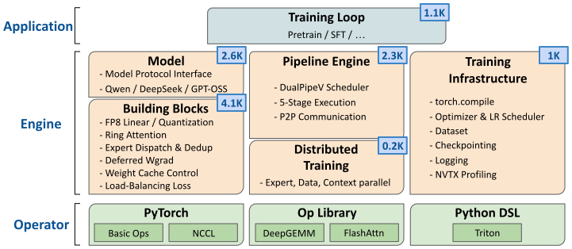

# PithTrain Architecture

A developer-oriented tour of how PithTrain is put together. The goal is that after reading this you can open any file in `pithtrain` and know roughly where you are, what it talks to, and why it exists.

PithTrain is a compact, agent-native MoE training framework. Production frameworks maximize model/feature/hardware coverage; PithTrain deliberately trades that away for a codebase small enough that a coding agent or human being can read end-to-end. The design favors local readability over cross-model reuse: it avoids plugin registries and runtime specs, so what runs at a given call site can usually be found by reading the code rather than tracing indirection. Keep that principle in mind; it explains many structural choices below.

If you are extending the framework (adding a model, operator, or feature), read this first, then see `CONTRIBUTING.md`.

## 1. The three layers

The codebase is organized into three layers, as illustrated below:

<p align="center">
  
</p>

| Layer | Directory | Responsibility |
|---|---|---|
| **Application** | `pithtrain/tasks` | End-to-end workflows: pretraining, corpus tokenization, checkpoint conversion. |
| **Engine** | `pithtrain/{dualpipe,models,modules,contexts}` | The bulk of PithTrain: pipeline scheduler, model implementations, and distributed/training infrastructure. |
| **Operator** | `pithtrain/operators` | Fused Triton / library-backed kernels for compute- and communication-critical paths. |

Everything sits on top of PyTorch (NCCL, FSDP2, DCP, `torch.compile`), with external kernel libraries (DeepGEMM, FlashAttention) and a Python kernel DSL (Triton) at the operator layer.

### Directory map

A high-level map (one representative file noted per area; the directories hold more, and file names drift, so treat these as entry points rather than an inventory):

```
pithtrain/
├── tasks/     # APPLICATION: launchable entry points (pretrain_lm.py)
├── dualpipe/  # ENGINE: DualPipeV scheduler + F/B overlap (dualpipev.py, overlap.py)
├── models/    # ENGINE: one file per model family (qwen3_moe.py); interface.py is the contract
├── modules/   # ENGINE: distributed + training infra (distributed.py, training.py)
├── contexts/  # ENGINE: runtime state (distributed.pp_group, training.dataset)
└── operators/ # OPERATOR: fused kernels
```

The sections below drill into the parts that carry the most architecture: the model contract, the pipeline engine, and the parallelism mesh.

## 2. The central abstraction: the 5-stage decoder layer

Everything in the engine is organized around one idea. A transformer decoder layer is split into five stages, cut at the expert-parallel communication boundaries. This split is what lets the pipeline overlap one micro-batch's compute with another's communication.

| # | Stage | What happens | Where it runs |
|---|---|---|---|
| 1 | **Attention** | LayerNorm → Attention → LayerNorm → expert routing (top-k selection) | compute stream |
| 2 | **Dispatch** | all-to-all: send each token to the rank holding its expert | **comm stream** |
| 3 | **MLP** | expert / MLP computation on the received tokens | compute stream |
| 4 | **Combine** | all-to-all: gather expert outputs back to the originating rank | **comm stream** |
| 5 | **Aggregate** | weighted sum of expert outputs + residual connection | compute stream |

Stages 2 and 4 (the all-to-alls) run on a **separate CUDA communication stream**, so the scheduler can hide them behind the stage-1/3/5 compute of a *different* micro-batch.

This split is reflected directly in the **model contract** in `pithtrain/models/interface.py`. Every model layer implements:

```python
class LayerProtocol(Protocol):
    idx: int
    mlp: MlpProtocol

    def forward_stage1(self, hidden_states, rotary_posemb, cu_seqlens=None) -> tuple[Tensor, Tensor, MoERouting | None]: ...
    def forward_stage3(self, gathered_tokens, expert_idxs, expand_idx) -> Tensor: ...
    def forward_stage5(self, moe_outs, moe_local_idxs, topk_weight, residual) -> Tensor: ...
    def reference_forward(self, hidden_states, rotary_posemb) -> Tensor: ...
```

Stages 2 and 4 (dispatch/combine) are framework-owned. The layer doesn't implement them; it hands the scheduler the routing metadata (the `MoERouting` returned by `forward_stage1`) and the scheduler drives the all-to-alls. The model-level contract is just:

```python
class ModelProtocol(Protocol):
    stage_index: int
    stage_count: int
    layers: Dict[str, LayerProtocol]

    def forward_prolog(self, hidden_states) -> Tensor: ...
    def forward_epilog(self, hidden_states) -> Tensor: ...
    def forward_posemb(self, S, cu_seqlens=None) -> tuple[Tensor, Tensor]: ...
    def reference_forward(self, hidden_states) -> Tensor: ...
```

A model is BF16-vs-FP8-agnostic: it builds its linears through `training.Linear` / `training.GroupedLinear` (bound to the FP8 or BF16 classes at setup, see section 6), and `reference_forward` exists so the optimized, distributed path can be checked against a plain single-GPU forward (see `validate-correctness`).

See `pithtrain/models/qwen3_moe.py` for a complete, readable implementation of this contract.

## 3. DualPipeV: the pipeline engine

`pithtrain/dualpipe` is the heart of the framework, derived from DeepSeek's [DualPipe](https://github.com/deepseek-ai/DualPipe) with the compute-communication overlap added on top.

**V-shaped placement.** Instead of one contiguous slice of layers per rank, the model is cut into `2 × pp_size` chunks arranged in a "V": rank *r* holds chunk *r* and chunk *2·pp_size − 1 − r*. That is why `DualPipeV` is built from a *pair* of modules, and it is what keeps each rank busy on both the forward and backward sweep (reducing the pipeline bubble). The `layer_partition` helper in `pithtrain/dualpipe/dualpipev.py` gives edge chunks fewer transformer layers, since they also carry `embed_tokens` / `norm` + `lm_head`.

**Entry point.** The application layer never touches the stages directly; it calls one method, which runs the overlapped forward/backward schedule and returns the loss:

```python
loss, outputs = model.step(
    global_tokens,                 # input ids on PP rank 0
    num_chunks=accumulate_steps,   # gradient-accumulation micro-batches
    criterion=criterion,           # loss fn, applied on the last PP rank
    labels=(global_labels,),
    return_outputs=False,
)
```

Inference reuses the same scheduler with `forward_only=True`. The overlap itself lives in `pithtrain/dualpipe/overlap.py`; `pithtrain/dualpipe/utils.py` adds wgrad delay (`WeightGradStore`) and an FP8 weight cache reused across micro-batches.

## 4. Distributed parallelism: the 4D mesh

`pithtrain/modules/distributed.py` builds a 4D device mesh and is the single source of truth for ranks. Four dimensions:

| Dim | Knob (`DistributedCfg`) | What it shards | Mechanism |
|---|---|---|---|
| **PP** | `pipeline_parallel_size` | model layers | DualPipeV + P2P |
| **EP** | `expert_parallel_size` | MoE experts | all-to-all dispatch/combine |
| **CP** | `context_parallel_size` | the sequence dimension | ring attention (zigzag layout) |
| **DP** | *inferred* | the batch (data parallel) | FSDP2 `fully_shard` |

`DP` is **not** configured directly; it is whatever is left over: `dp_size = world_size / (pp_size · cp_size · ep_size)`.

The mesh axis order is `(PP, DP, CP, EP)`, outer-to-inner. CP and EP sit innermost on purpose: their collectives (ring K/V exchange, MoE all-to-all) are the most frequent, so keeping them in the innermost mesh dimension keeps that traffic inside the NVLink domain.

**What FSDP shards over.** Expert weights are already unique per EP rank, so FSDP shards them only across `dp × cp`. Every *other* weight (attention, router, embeddings, `norm`, `lm_head`) is replicated across EP, so FSDP shards it across `dp × cp × ep`, i.e. over the EP dimension as well. (`sharding_strategy="fsdp"`, the default, is the case above; `"hsdp"` instead replicates across DP and shards within `cp × ep`, for when one DP replica already fits.) The per-parameter-class mesh selection is in `apply_fsdp` in `pithtrain/modules/training.py`.

`pithtrain/modules/distributed.py` also installs fail-fast shutdown: a fail-fast excepthook plus an NCCL heartbeat timeout, so a single crashing rank brings the job down quickly instead of leaving peers to hang on the watchdog.

## 5. End-to-end training flow

Putting it together, here is one training run, top to bottom (`pithtrain/tasks/pretrain_lm.py`):

```
launch(cfg)
│
├─ setup_logging(cfg) / setup_distributed(cfg) / setup_training(cfg)   # build the runtime
├─ load_checkpoint(cfg, ctx)                                  # resume if a checkpoint exists
│
└─ while step < max_steps:  train_step(cfg, ctx)
   │
   ├─ get_global_batch(...)        # PP rank 0 reads this rank's slice of the global batch,
   │                               #   applying zigzag CP sharding of the sequence
   ├─ model.step(tokens, num_chunks=accum, criterion, labels)   # section 3: DualPipeV F/B + loss
   ├─ (CP) all-reduce + average the loss across CP ranks
   ├─ scale loss + grads by 1/num_tokens  # token-weighted: global count of non-ignored (-100) tokens
   ├─ clip_grad_norm_(...)         # global L2 norm across FSDP + pipeline ranks
   ├─ optimizer.step(); scheduler.step(); zero_grad()
   └─ log loss / lr / grad-norm / tokens-per-sec / peak-mem (rank 0, + wandb)
```

Batch indexing in `get_global_batch` accounts for both DP and EP rank when slicing the dataset, and splits each sequence into a "front" and mirrored "back" block for zigzag context parallelism (matching `pithtrain/operators/ring_attention.py`).

## 6. FP8 training

FP8 is selected by a single config flag, `cfg.fp8`. At training setup (`pithtrain/modules/training.py`) it binds the linear classes the models build with, published on the `training` context:

```python
training.Linear        = FP8Linear        if cfg.fp8 else nn.Linear
training.GroupedLinear = FP8GroupedLinear if cfg.fp8 else GroupedLinear   # BF16
```

Because models build their linears through `training.Linear` / `training.GroupedLinear` rather than hard-coding a class, switching a whole model between BF16 and FP8 is one config flag (`cfg.fp8`). The FP8 path (`pithtrain/operators/linear.py` and `pithtrain/operators/grouped_linear.py`) uses 128-element block scaling backed by DeepGEMM, with custom Triton quantization kernels in `pithtrain/operators/deepgemm_quantize.py` (E8M0/MXFP8 scales on Blackwell, float32 scales on Hopper).

`torch.compile(fullgraph=True)` is applied to all transformer computation **except** the MoE forward/backward, whose per-expert shapes are data-dependent under EP. Full-graph mode is intentional: it turns a silent graph break into a compile error.

## 7. Checkpointing

`pithtrain/modules/checkpoint.py` bridges two representations, saved via PyTorch **DCP**:

- **Canonical (on disk)**: pipeline-independent. The `module.{N}.` DualPipeV prefix is stripped so layer FQNs use *global* IDs (`layers.0.weight`), and stacked per-EP-rank expert tensors are expanded to *individual* expert weights with global IDs.
- **Localized (in memory)**: what the running model actually holds, with DualPipeV prefixes present and experts stacked per EP rank.

Saving converts localized → canonical (`to_canonical_model` / `to_canonical_optim`); loading converts canonical → localized (`to_localized_*`). Because disk format is parallelism-independent, **a checkpoint is reshardable**: you can resume the same run under a different PP/EP/DP layout. The HuggingFace import path produces a model-only checkpoint (no optimizer/scheduler), which `load_checkpoint` detects and loads non-strictly.

## 8. Operators

`pithtrain/operators` holds the performance-critical kernels. The rule for this layer: **every operator ships a PyTorch reference implementation** used by its correctness test. A few of the most important, roughly in order:

1. **`ep_dispatch.py`**: fused Triton kernels for expert-parallel token dispatch with deduplication; central to MoE routing and the all-to-all overlap.
2. **`ring_attention.py`**: zigzag, causal-balanced ring attention for context parallelism (standard + MLA-aware variants).
3. **`deepgemm_quantize.py`**: fused block-scaled FP8 quantization behind the FP8 training path.
4. **`token_scatter.py`**: groups tokens per expert ahead of the grouped GEMM.

The rest are smaller fused activation, loss, and attention-wrapper kernels.

## 9. Agent skills

PithTrain ships agent skills under `.agents/skills`: procedural playbooks a coding agent loads on demand for recurring framework tasks. They are part of the system's design, not an add-on: each encodes a scoped procedure with explicit prerequisites and a verifiable PASS/FAIL outcome.

Current skills include `add-new-model`, `capture-nsys-profile`, `validate-correctness`, etc. See `.agents/skills` for the full set.

When a task matches a skill, use the skill rather than re-deriving the procedure. When you add a recurring workflow, consider shipping it as one.

## 10. Config & context: `*Cfg` + `setup_*` + `contexts`

A minor but pervasive convention worth recognizing when reading the code. Each subsystem has a declarative `*Cfg` (user-set knobs, serializable): `DistributedCfg`, `TrainingCfg`, and `LoggingCfg`, each inheriting `SlottedDefault` (`pithtrain/config.py`) as `@dataclass(init=False, slots=True)`. The top-level `PretrainLMCfg` composes them.

The *live* runtime state lives in the `pithtrain/contexts` package: small modules (`distributed`, `training`, `logging`) that hold module-level globals: process groups, the device mesh, `distributed.device`, the built model, and the resolved `training.Linear` / `training.GroupedLinear`. A per-subsystem `setup_*(cfg)` function (`setup_logging`, `setup_distributed`, `setup_training`) reads the config, builds the runtime, and publishes it into those modules. So any file reads the current state with a plain `from pithtrain.contexts import distributed` (then `distributed.pp_group`, `distributed.device`) instead of threading a context object through every call site. This is the same "discoverable by local reading" trade as the rest of the framework. Follow the `*Cfg` + `setup_*` + `contexts` shape when adding a subsystem.

## Where to look next

| If you want to… | Start here |
|---|---|
| Add a new model | `CONTRIBUTING.md` + `add-new-model` skill + `pithtrain/models/interface.py` |
| Add / change a kernel | `pithtrain/operators/<op>.py` (+ its reference impl) and `tests` |
| Understand the schedule | `pithtrain/dualpipe/dualpipev.py` → `pithtrain/dualpipe/overlap.py` |
| Change parallelism behavior | `pithtrain/modules/distributed.py` |
| Trace a full training step | `pithtrain/tasks/pretrain_lm.py` (`train_step`) |
| Estimate memory for a config | `python -m tools.memory_estimator --help` (still under construction) |
